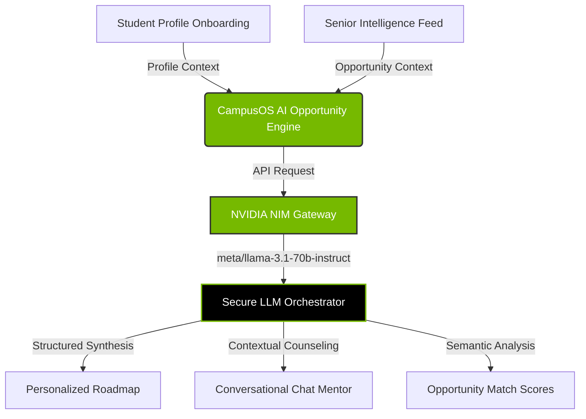
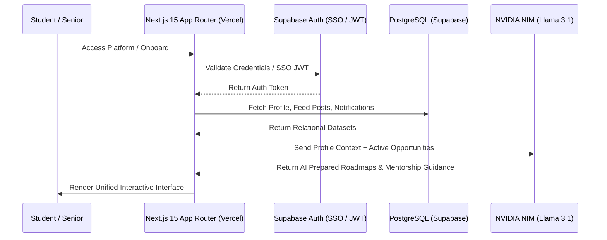

<div align="center">

# 🌌 CampusOS
### **Democratizing Hidden Institutional Intelligence Using AI**

*An AI-powered operating system for college opportunities designed to eliminate the "Senior Network Privilege Gap."*

[](https://nextjs.org/)
[](https://supabase.com/)
[](https://build.nvidia.com/)
[](https://tailwindcss.com/)
[](https://www.typescriptlang.org/)
[](https://vercel.com/)

**"CampusOS is not just a hackathon project. It is an AI-powered operating system for democratizing institutional knowledge."**

</div>

---

## 📌 Mission Statement
For first-generation and underprivileged college students, the path to elite scholarships, high-impact research, and career-defining internships is often blocked by an invisible barrier: the **"Senior Network Privilege Gap."** CampusOS disrupts this inequality. By combining a verified peer-to-peer credibility engine with NVIDIA NIM AI agentic intelligence, CampusOS maps, curates, and distributes unadvertised institutional opportunities to students who need them most.

---

## ⚠️ The Problem: The "Senior Network Privilege Gap"

In higher education, the most valuable opportunities are rarely listed on public job boards or college bulletins. They reside in informal networks:
* **Trapped Senior Circles:** Sophomore internship programs, corporate referrals, and interview strategies are passed down privately within selective student clubs, fraternities, or informal groups.
* **Invisible Faculty Curriculums:** Professors hire research assistants through direct recommendations rather than public portals, leaving high-potential students unaware of openings.
* **Asymmetric Resource Access:** Students without immediate family networks in tech or academia miss early deadlines, resulting in a compounding opportunity gap.
* **Information Overload & Noise:** General job portals spam students with irrelevant listings, failing to account for their specific academic branch, local course load, and dynamic skill progression.

This structural asymmetry ensures that privilege, rather than pure potential, frequently dictates academic and career trajectories.

---

## 🌐 Demo Experience

## 🌐 Deployment Link

DEPLOYMENT LINK -

## 🎥 Demo Video

DEMO VIDEO LINK -

## 🔐 Demo Credentials

### Student Portal

STUDENT PORTAL -

### Institutional Portal

INSTITUTIONAL PORTAL -

---

## ⚡ The Solution: Unified Institutional Intelligence

CampusOS creates a transparent, high-fidelity infrastructure to bridge the information divide:
1. **Bypassing the Gatekeepers:** A centralized **Senior Intelligence Feed** incentivizes high-performing upperclassmen to share internal referrals, faculty lab tips, and interview guides.
2. **NVIDIA NIM-Powered Orchestration:** A personalized AI agent parses student branches, current skill sets, and targets to synthesize customized, actionable career preparation roadmaps.
3. **Credibility & Trust Infrastructure:** A gamified, peer-verified rating system prevents spam and ensures all shared opportunities, contacts, and tips carry measurable trust signals.
4. **Proactive Opportunity Detection:** Automated real-time notifications match students to expiring high-value opportunities before they vanish from informal networks.

---

## 🌟 Core Features

| Feature | System Purpose | Real-World Impact | AI / Technical Integration |
| :--- | :--- | :--- | :--- |
| **🧠 AI Mentor Assistant** | 24/7 conversational companion for contextual academic and placement counseling. | Simulates mock interviews and reviews code/pitches before students approach professors or recruiters. | **NVIDIA NIM** (`meta/llama-3.1-70b-instruct`) with dynamic context injection. |
| **📡 Senior Intel Feed** | Real-time crowd-sourced channel for internal referrals, lab openings, and club recruitments. | Exposes unadvertised opportunities directly to sophomore and junior students. | Markdown-rendered card system with PostgreSQL relation constraints. |
| **📈 Opportunity Match Scores** | Computes semantic alignment between student profile skills and posted opportunities. | Prevents application fatigue by highlighting the top 5% of highest-yield opportunities. | Llama-powered profile classification and alignment algorithms. |
| **🗺️ AI Action Plans** | Auto-generates customized, step-by-step technical and preparation roadmaps. | Breaks down complex objectives (e.g., getting a Google STEP referral) into daily actionable tasks. | LLM structured output parsing mapping branches to target parameters. |
| **🎯 Campus Visibility Score** | Live assessment of profile completeness, skill validation, and platform contribution. | Motivates students to document their projects, raising their profile to recruiters. | Calculated dynamically via DB-level user engagement algorithms. |
| **🕸️ Network Visualization** | Inter-departmental relationship graphing showing opportunity pathways. | Helps students visualize which seniors have contacts at target companies or labs. | Recharts-powered analytics and CSS-rendered relationship hierarchies. |
| **📊 Opportunity Heatmaps** | Graphical distribution of active postings across branches and companies. | Highlights hiring and research trends across computer science, electronics, and IT. | Animated **Recharts** displaying branch allocations and monthly active trends. |
| **🔔 Smart Notifications** | Priority alerts for approaching deadlines and high-relevance referrals. | Ensures first-generation students never miss critical bypass windows. | Relational database triggers emitting tailored alert messages. |
| **🔌 Demo Mode** | Zero-config client-side fallback system for API calls. | Allows judges and developers to test deep platform flows immediately without API keys. | Local high-fidelity simulation engine matching schema types. |
| **⌨️ Command Palette** | Raycast-style keyboard-driven global navigation and action system (`Cmd+K`). | Accelerates developer and user workflows through immediate command execution. | React state-managed keyboard listener with instant UI switching. |
| **🛡️ Credibility System** | Decentralized verification for posts and reviews based on senior feedback. | Mitigates misinformation and guarantees that high-rank posts represent authentic roles. | Dynamic PostgreSQL-backed scoring schema. |

---

## 🎨 UI/UX Design System & Philosophy

CampusOS is designed to look and feel like an elite, investor-grade enterprise SaaS application. Our interface rejects generic design templates in favor of a custom-engineered visual language:

```
┌────────────────────────────────────────────────────────┐
│                   GLASSMORPHIC SHELL                   │
│   ┌────────────────────────────────────────────────┐   │
│   │               CINEMATIC GRADIENT               │   │
│   │  🎨 HSL Palette: Dark-slate base               │   │
│   │  ✨ Accent Highlights: Emerald (#3ECF8E)       │   │
│   │  ⚡ Interactive Glows: Electric Cyan           │   │
│   └────────────────────────────────────────────────┘   │
│   ┌────────────────────────────────────────────────┐   │
│   │              MICRO-INTERACTIONS                │   │
│   │  ⚡ Raycast Command Palette: Cmd + K            │   │
│   │  🖱️ Hover Transitions: 300ms cubic-bezier       │   │
│   │  📊 Smooth Rendering: Recharts animations      │   │
│   └────────────────────────────────────────────────┘   │
└────────────────────────────────────────────────────────┘
```

### Key Design Pillars
* **High-Contrast Glassmorphism:** Subtle background blurs (`backdrop-blur-md`) overlaid on deep slate surfaces (`bg-slate-900/80`), creating multi-dimensional workspaces.
* **Cinematic Gradients:** Non-linear color shifts utilizing emerald greens, deep teals, and dark purples to anchor user focus onto high-priority opportunities.
* **Premium Motion System:** Carefully tuned CSS transitions (`transition-all duration-300 ease-out`) that respond immediately to user interactions, making the platform feel alive.
* **Production-Grade Typography:** Clean, modern Sans-Serif font weights paired with precise letter-spacing to optimize technical readability.
* **Inspirations:**
  * **Linear:** Sleek, grid-aligned workspace interfaces and minimal borders.
  * **Perplexity:** Crisp, beautifully structured AI output formatting and responsive cards.
  * **Vercel:** Clean typography, monochromatic highlights, and rapid page transitions.
  * **Raycast:** Direct, keyboard-driven navigation via a global command bar.
  * **Stripe:** Ultra-smooth interactive dashboard grids and rich data visualizations.

---

## 🧠 AI Architecture & Orchestration

The AI layer in CampusOS goes beyond a basic chat wrapper. It operates as an **orchestration engine** that binds student profiles to real-time institutional opportunities.



### NVIDIA NIM Integration
* **Model Pipeline:** We deploy Meta's `llama-3.1-70b-instruct` model via the **NVIDIA NIM API** for sub-second, low-latency inferencing.
* **Secure API Gateway:** Requests are proxied through a secure Next.js Server Route (`/api/nvidia`) to completely isolate the API keys, preventing client-side interception.
* **System Prompt Injection:** The student's academic branch, current year, technical skills, and career interests are compiled server-side and injected into the LLM system context. This guarantees that every answer contains hyper-local, branch-specific context.
* **High-Fidelity Client Simulation:** If NVIDIA NIM API keys are missing or invalid, the system automatically falls back to an offline simulation engine. This engine parses student parameters to output matching custom roadmaps and chat responses, ensuring judges can interact with all AI features out of the box.

---

## ⚙️ System Architecture

CampusOS is structured as a scalable, high-performance web application designed for deployment on edge infrastructure.



* **Frontend:** **Next.js (App Router)** utilizing React Server Components (RSC) to maximize load speeds and minimize client-side bundle sizes.
* **Backend:** **Supabase** acting as the identity, storage, and real-time synchronization layer.
* **Database:** **PostgreSQL** configured with relational schemas, strict constraints, and Row-Level Security (RLS) policies.
* **AI Processing:** **NVIDIA NIM** handling semantic profiling and contextual counseling.
* **Deployment:** Hosted on **Vercel** with edge caching for static assets.

---

## 💾 Database Design & RLS Policies

The database is built on PostgreSQL, utilizing custom types, relational foreign keys, and strict Row-Level Security (RLS) to enforce data privacy and access control.

```
                  ┌──────────────────────┐
                  │       profiles       │
                  └──────────┬───────────┘
                             │ (1:N)
         ┌───────────────────┴───────────────────┐
         ▼                                       ▼
┌──────────────────┐                    ┌──────────────────┐
│      posts       │                    │   chat_history   │
└────────┬─────────┘                    └──────────────────┘
         │ (1:N)
   ┌─────┴───────────────────┐
   ▼                         ▼
┌──────────────────┐  ┌──────────────────┐
│     comments     │  │     upvotes      │
└──────────────────┘  └──────────────────┘
```

### Table Definitions & Relational Integrity
1. **`profiles`**: Links to authenticated users. Holds critical profile parameters (name, branch, skills, interests, year, credibility score, and contribution badge).
2. **`posts`**: Core table for the Senior Intelligence Feed. Supports categories via a custom Postgres ENUM (`opportunity_category` including Internships, Placements, Scholarships, Faculty Tips, etc.). Includes urgency scoring, target branch mapping, and upvote/downvote tallies.
3. **`comments`**: Enables multi-threaded conversations on posts, allowing students to ask clarifying questions about specific referral links or research positions.
4. **`upvotes`**: Enforces a unique constraint combination `(post_id, user_id)` to prevent double upvoting, ensuring credibility metrics remain unmanipulated.
5. **`notifications`**: Contextual, read-tracked message table emitting deadline alerts and trending opportunities.
6. **`chat_history`**: Persists conversational logs for the AI Mentor, allowing users to return to past career roadmap discussions.

### Row-Level Security (RLS) Policies
To secure student records and prevent malicious write operations, RLS is enabled on all tables:
* **Profiles:** Anyone can read public student profiles; updates are restricted exclusively to the profile owner (`auth.uid() = id`).
* **Posts:** Read access is public. Creations require active user authentication. Updates/deletes are strictly bounded to the original author (`auth.uid() = author_id`).
* **Upvotes:** Users can only manage their own votes (`auth.uid() = user_id`), maintaining mathematical integrity for credibility metrics.
* **Notifications:** Read and write commands are isolated to the corresponding recipient.

---

## 🏆 Credibility & Rank System

To ensure the Senior Intelligence Feed remains a high-trust channel, CampusOS implements a dynamic credibility score model. This system eliminates spam and highlights verified institutional knowledge.

### Contribution Rank Progression

```
  [ Rookie ] ──► [ Contributor ] ──► [ Mentor ] ──► [ Pioneer ] ──► [ Guru ]
   (0+ Pts)         (150+ Pts)        (350+ Pts)     (600+ Pts)      (1000+ Pts)
```

### Scoring Algorithms
Seniors and contributors accumulate points based on peer verification and student success outcomes:

* **Intel Upvote (`+15 Points`):** Received when a student upvotes an opportunity posted in the feed, confirming the post was helpful and accurate.
* **Verified Faculty Tip (`+50 Points`):** Awarded when a senior posts a faculty research tip that is validated by comments from other students who successfully contacted the lab.
* **Direct Referral Spot Fulfillment (`+100 Points`):** Earned when a junior student marks that they successfully secured an interview using a referral shared by the senior.
* **Spam Flag Penalty (`-30 Points`):** Applied if a post is reported and flagged by administrators as inaccurate or duplicate, ensuring high penalty costs for bad actors.

---

## 🛠️ Technology Stack

| Layer | Technology | Version | Purpose |
| :--- | :--- | :--- | :--- |
| **Frontend** | Next.js | `15.x / 16.x` | Core application framework with Server Components and route optimization. |
| **Styling** | Tailwind CSS | `v4` | Dark mode-first styling engine utilizing premium custom gradients. |
| **Components** | shadcn/ui | Latest | Consistent, high-fidelity primitive layout components. |
| **Database** | PostgreSQL | `v16` | Fully relational storage engine supporting RLS and custom types. |
| **Backend** | Supabase | Latest | Auth triggers, database synchronization, and real-time webhooks. |
| **AI Orchestration** | NVIDIA NIM | Llama 3.1 | Sub-second AI inference handling profile matching and roadmapping. |
| **Data Viz** | Recharts | Latest | Smoothly animated, interactive charts for opportunity heatmaps. |
| **Language** | TypeScript | `5.x` | Full end-to-end type safety for data collections and state trees. |
| **Deployment** | Vercel | Production | High-availability global edge deployment infrastructure. |

---

## ⚖️ Hackathon Engineering Discipline: "Commit Happens"

CampusOS was built under rigorous engineering principles for the **Commit Happens** Hackathon:
* **Incremental Commits:** Codebase evolution is tracked through isolated, semantic commits. Every feature transition (from authentication to the AI recommendation engine) is documented with clear descriptions.
* **Strict Modular Separation:** Zero clutter. UI shells, components, state hooks, and server utilities are completely isolated into independent files to facilitate rapid testing and team alignment.
* **Continuous Repository Auditing:** Repository structure is kept clean, removing temporary build files and environment templates to ensure seamless open-source onboarding.
* **Dry-Run & Simulated Fail-safes:** All key interfaces include robust mock fallbacks. If database connections or API keys encounter limits during judging, the application automatically handles exceptions by falling back to simulation data without crashing.

---

## 🔮 Future Roadmap

* **🌐 Multi-College Intelligence Graphs:** Expand from single-campus databases to inter-collegiate networks, allowing students to view opportunity trends and transfer pathways across different institutions.
* **🎓 Verified Alumni Network:** Integrate professional OAuth (LinkedIn/GitHub) to allow alumni to post verified, company-sponsored referral slots exclusively for their alma mater's students.
* **🔮 AI Placement Forecasting:** Analyze student profiles and branch dynamics using machine learning to predict placement likelihood and suggest target skills to bridge specific employment gaps.
* **🏆 Smart Scholarship Matching Engine:** Connect a continuous web scraper to the NVIDIA NIM parser, automatically matching students to international and local scholarships as soon as their profiles meet eligibility parameters.
* **📊 Institutional Analytics for Deans:** Provide college administrators with aggregated, anonymous dashboards detailing where students face opportunity bottlenecks and which departments have the highest placement rates.

---

## 🌌 Team Vision: Democratizing Opportunities

We believe that **potential is distributed equally, but opportunity is not.** 

First-generation college students enter university with the drive to succeed, but they are often forced to navigate an invisible curriculum without a map. While privileged students slide into top-tier research projects and sophomore internships through established networks, underprivileged students are left applying to standard job boards with thousands of other candidates.

**CampusOS is designed to level the playing field.** By turning unadvertised institutional intelligence into a shared, verified, and AI-optimized asset, we give every student—regardless of background or family network—the map they need to chart their own course. 

*No student should miss a career-defining opportunity simply because they didn't know it existed.*

***

<div align="center">
  <sub>Built with 💚 for first-generation students everywhere.</sub>
</div>
